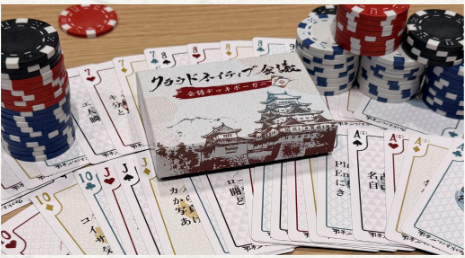
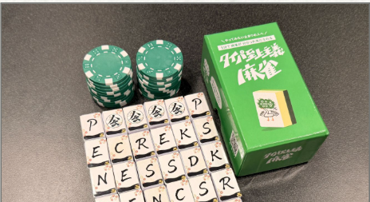

### はじめに

[クラウドネイティブ会議](https://kaigi.cloudnativedays.jp/)に運営スタッフとして参加してきました。

名古屋で1000人を集めるという大きな目標に向かって、運営としてどのように準備を進めていくべきなのか、運営の裏側を知ることができたのは非常に貴重な経験でした。

> クラウドネイティブ会議、無事に閉幕しました！☁
>
> 現地にお越しいただいた皆様、オンラインでご視聴いただいた皆様、本当にありがとうございました。
>
> イベントの改善のため、アンケートのご協力をお願いします。5/24(日)まで受付中です↓
>
> https://t.co/yZsEJfjCU8
>
> — [@cloudnativedays](https://x.com/cloudnativedays/status/2055558885298032767?s=20)

### 運営としての役割

自分の役割としては主に、参加者交流ブースの設計を担当しました。

セッションの合間に技術的な話題から雑談まで幅広くコミュニケーションが生まれる場所を作ることを目指しました。

見ず知らずの人同士が自然と会話するというのはなかなか難しいです。

今回は、複数人が一緒に遊ぶゲームを用意するというのが有効な手段ではないかと考え、5分程度で遊べる簡易版のオリジナル麻雀とポーカーを用意しました。

オリジナル麻雀の元ネタとして使わせていただいた、[タイパ至上主義麻雀](https://taipa-games.com/products/mahjong)は良い商品なのでおススメです。

想定以上に遊んでもらえて、参加者同士の交流のきっかけになっていたように感じました。

他にもイベントHPもこの個人ブログと同じAstro製ということで、少しだけPRを出していたりします。

ここ1年くらい友人と趣味でやっているPodcast内でも触れているのでぜひ

https://listen.style/p/kankodori-radio/pq4zmewg

### 名古屋観光

愛知県に戻るときは普段は実家に帰るので、名古屋駅周辺のホテルに泊まるのは初めてでした。名古屋観光も堪能できてよかったです。

> ひつまぶしっ！！！
>
> — [@taisuke_bigbaby](https://x.com/taisuke_bigbaby/status/2055508851064234075?s=20)
